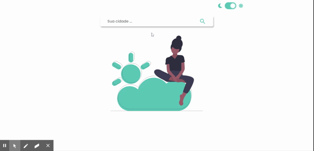

<div align="center" id="top"> 
  

  &#xa0;

  <a href="https://simpleweatherreactapp.netlify.app">Demo</a>
</div>

<h1 align="center">Weather React App</h1>

<p align="center">
  
  
  
  
</p>

<p align="center">
  <a href="#speaker-about">About</a> &#xa0; | &#xa0; 
  <a href="#sparkles-features">Features</a> &#xa0; | &#xa0;
  <a href="#rocket-technologies">Technologies</a> &#xa0; | &#xa0;
  <a href="#white_check_mark-requirements">Requirements</a> &#xa0; | &#xa0;
  <a href="#checkered_flag-starting">Starting</a> &#xa0; | &#xa0;
  <a href="#memo-license">License</a> &#xa0; | &#xa0;
  <a href="https://github.com/maurodesouza" target="_blank">Author</a>
</p>

&#xa0;

## :dart: About ##

I was looking for any idea to practice a little React with typescript, and scouring a little on the internet, I found a [free weather API](https://openweathermap.org) :partly_sunny:.

So I resolved to create a simple weather app, and as a plus, learn about the dark mode.

The app is simple, there's an input to put the city, and if the city exists, is shown the current weather together with five days forecast, else, is shown an error.

The API I used was the free plan of the [open weather map](https://openweathermap.org), with a limit of 60 calls per minute.

You can see the demo <a href="https://simpleweatherreactapp.netlify.app">here</a> :point_left::point_left:

## :sparkles: Features ##

:heavy_check_mark: Show current weather;\
:heavy_check_mark: Show five days forecast;\
:heavy_check_mark: Dark and light mode;\
:heavy_check_mark: Save theme and last search in local storage;\
:heavy_check_mark: Responsive app;

## :rocket: Technologies ##

- [React](https://pt-br.reactjs.org)
- [Axios](https://github.com/axios/axios)
- [Eslint](https://eslint.org)
- [Date-fns](https://date-fns.org)
- [Typescript](https://www.typescriptlang.org)
- [React switch](https://www.npmjs.com/package/react-switch)
- [Styled components](https://styled-components.com)

## :white_check_mark: Requirements ##

Before starting :checkered_flag:, you need to have [Git](https://git-scm.com) and [Node](https://nodejs.org/en/) installed, and also an account in [open weather map](https://openweathermap.org) to get your API key.

## :checkered_flag: Starting ##

```bash
# Clone this project
$ git clone https://github.com/maurodesouza/weather-react-app

# Access the frontend repo
$ cd weather-react-app/frontend

# Create .env file with
REACT_APP_WEATHER_KEY=YOUR_KEY

# Install dependencies
$ yarn

# Run the project
$ yarn start

# The server will initialize in the <http://localhost:3000>
```

## :memo: License ##

This project is under license from MIT. For more details, see the [LICENSE](LICENSE.md) file.


Made with :heart: by <a href="https://github.com/maurodesouza" target="_blank">Mauro de Souza</a>

&#xa0;

<a href="#top">Back to top</a>
<hr>
